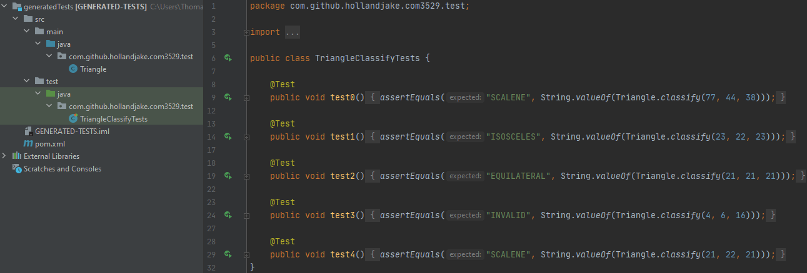

[](https://codecov.io/gh/hollandjake/COM3529)

<br />
<p align="center">
  <a href="https://github.com/hollandjake/COM3529">
    
  </a>

  <h3 align="center">McTest</h3>

  <p align="center">
    An awesome automatic test generation program
  </p>
</p>

## About McTest
McTest takes in your java file and generates automatic JUnit tests. McTest does this by analysing your method's structure of conditions and applies an evolutionary 
algorithm to obtain full condition coverage, the result is a detailed coverage report, supplimented by a new Java project of JUnit tests 
that can be compiled separately and run. McTest makes use of threading to achieve optimum speeds as well as other maven dependencies which allow McTest to function better.

### McTest's Automation
All a human tester would need to do is run our jar file on the class to be tested, as McTest is fully automatic and contains the following features:
- [x] Extracts and analyses all logical conditions in each method with JavaParser, e.g. conditions inside IF, WHILE and FOR
- [x] The method's conditions are automatically parsed and intrumented
- [x] Test data generation is fully automated with use of an evolutionary algorithm
- [x] The test suite is written into JUnit Java code that can be compiled separately and run
- [ ] Automatic multiple critia test requirement generation
- [x] Coverage level is automatically computed and reported


<!-- TABLE OF CONTENTS -->
<details open="open">
  <summary>Table of Contents</summary>
  <ol>
    <li>
      <a href="#about-mctest">About McTest</a>
      <ul>
        <li><a href="#mctests-automation">Automation</a></li>
      </ul
    </li>
    <li>
      <a href="#the-team">The Team</a>
    </li>
    <li>
      <a href="#how-to-install-and-run-mctest">How to install and run McTest</a>
      <ul>
        <li><a href="#installation">Installation</a></li>
        <li><a href="#usage">Usage</a></li>
        <li><a href="#maven-dependencies">Maven Dependencies </a></li>
      </ul>
    </li>
    <li>
      <a href="#worked-examples-of-mctest">Worked Examples of McTest</a>
      <ul>
        <li><a href="#trianglejava">Triangle.java</a></li>
        <li><a href="#bmicalculatorjava">BMICalculator.java</a></li>
      </ul>
    </li>
    <li><a href="#acknowledgements">Acknowledgements</a></li>
  </ol>
</details>

## The Team
* Jake Holland (jholland2@sheffield.ac.uk)
* Thomas Boyd (tlboyd1@sheffield.ac.uk)

## How to install and run McTest
Here you will find information on getting started with McTest

### Installation 
On our [releases page](https://github.com/hollandjake/COM3529/releases/) you can download the TestGenerator.jar file, 
alternatively you can download the project's source code and run the following to generate the TestGenerator.jar which will then be located inside the target folder.
```sh
  mvn package
  ```

### Usage 
Once you have the TestGenerator.jar you can run it with the following program arguments
* -g (Path to Java class file you want to run McTest on)
* -o (Path to the directory you want to output the JUnit tests to)

For example
```sh
  java -jar "TestGenerator.jar" -g "Path to class" -o "Path to JUnit output directory"
  ```

### Maven Dependencies 
* [JavaParser](https://github.com/javaparser/javaparser "JavaParser's Github")
* [JUnit4](https://github.com/junit-team/junit4 "JUnit4's Github")
* [Project Lombok](https://projectlombok.org/ "Project Lombok's Website")
* [Math Parser](http://mathparser.org/ "Math Parser's Website")
* [Reflections](https://github.com/ronmamo/reflections "Reflections's Github")
* [Apache Commons](https://github.com/apache/commons-lang "Apache Commons Github")
* [OpenHFT Compiler](https://mvnrepository.com/artifact/net.openhft/compiler "OpenHFT's Website")
* [Simple Logging Facade](http://www.slf4j.org/ "Simple Logging Facade's Website")

## Worked Examples of McTest
Supplied in the source code at "src/main/resources" are java files Triangle.java and BMICalculator.java which both can demonstrate McTest in action.

You can run Triangle.java and BMICalculator.java by executing the tests shouldGenerateTestsForTriangle() and shouldGenerateTestsForBMICalculator() respectively, 
these tests are located at "src/test/java/com/github/hollandjake/com3529/test/ClassTestGeneratorTest.java"

After executing the tests, the console will let you know where the project is of the JUnit tests which were generated. The new project for the tests will look like the 
following for the Triangle.java and BMICalculator.java respectively. There will also be a coverage report PDF outlining the conditional coverage of the test suite.

### Triangle.java

### BMICalculator.java


## Acknowledgements
